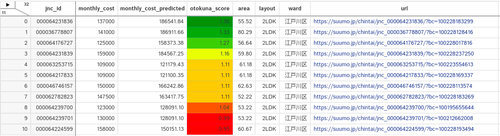
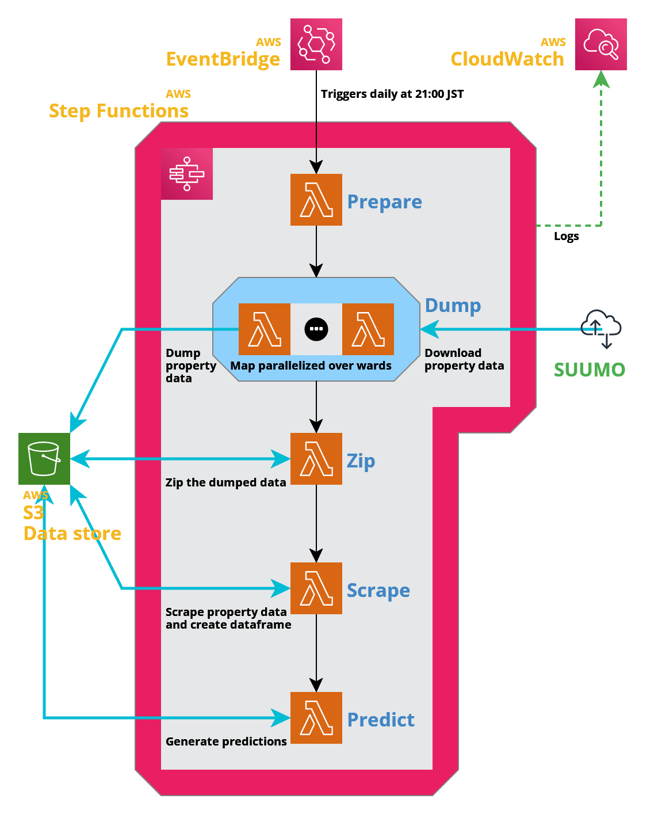

# otokuna

**otokuna** is a system to aid the discovery of good deals of rental properties, built 
and automated on a serverless architecture, and that it can be interacted with via a web 
app.

I tend to move rather often, and every time it is a hassle to peruse the real estate websites
and find a good deal, so I built this out of the need to make the process faster and easier.

Read below if you are interested on the implementation details and on how to roll out your 
own system.

## Approach

The approach is essentially to assign a "good deal"-ness score to each property that, with 
the help of a web app, allows one to hone in on the interesting properties that are potential 
"good deals". A service built on a serverless architecture monitors daily any newly published 
properties, fetches their data, scores them and makes this data available to the web app.

Here, a "good deal" is any property that is significantly cheaper when compared against other 
properties with similar qualities. The "significant" part is, at the moment, determined 
qualitatively, so this is a human-in-the-loop approach.

The GUI, which is built on a web app, looks like this:

<p align="center">
    
</p>

The properties are displayed as a table with the columns showing all the relevant information 
(rent, area, location, etc) and the "good deal" score. The properties can be sorted/filtered 
by their columns, and the score can be visualized as a heatmap, so finding the interesting 
properties is made easier. The table is rendered with [Dtale](https://github.com/man-group/dtale), 
which has many handy tools to filter, sort and plot the data.

### Scope

This application is limited to the following **rental** properties:

* properties of type "condo" (マンション),
* located in any of the 23 wards (区) of Tokyo (東京),
* and published on [Suumo](https://suumo.jp/).

While this application is customized to rental properties, it should be useful as a blueprint 
and possible to adapt to find good deals of other regions of Japan, other real estate websites, 
or perhaps other things (e.g. cars) on other websites. Also, the system runs well within 
the free tier of most the AWS services it uses.

### How is a "good deal" quantified?

In this application, a "good deal" is defined by the following score, 
which I call the "otokuna score" (お得なスコア):

```
otokuna score = predicted median monthly cost / actual monthly cost
```

* the "actual monthly cost" is the rent plus the administration fee (in JPY), as advertised 
  by the broker, and

* the "predicted median monthly cost" (also in JPY) is given by a regression model trained 
  on historical data that estimates how much the property would cost given its area, layout, 
  location and other such features.

For example, a score of 2 means that, given the property features, the predicted value is 
twice the actual value. The higher this value, the better a deal we believe the property 
is because it is supposed to be more expensive than what is being advertised.

I chose this approach due to its simplicity as it is easier to predict a median value than 
to model a distribution.

For more information about the model, please refer to [this section](#about-the-model).

There certainly are other ways to define what a "good deal" is. For example, a more statistically 
principled approach would be to model the posterior distribution of the cost and set a 
threshold on the quantile a property falls within (which could also be predicted directly with 
quantile regression), e.g. the bottom 5% (with prices lower than mean/median/mode) could 
be regarded as "good deals", but without more information on the spread of the posterior 
distribution or some sort of hand-curated examples of "good deals", it can be hard to choose 
an appropriate threshold and one could end up with a virtually impossible threshold (e.g. 
hunting for a 10,000 yen property among properties that usually cost 100,000 yen) or a useless 
threshold (e.g. finding a 99,990 yen property among properties that usually cost 100,000 yen).

Another approach is to use outlier detection methods such as Isolation Forest or Local Outlier 
Factor, but the outlier-ness scores and the decision thresholds may be hard to interpret and 
tune.

### Why Suumo?

Besides Suumo, there are other websites that provide a similar service such as [Chintai](https://www.chintai.net/) 
and [Home's](https://www.homes.co.jp/), but I chose Suumo because:

* according to [some](https://sumai-kyokasho.net/rental-site-recommended/) [sources](https://mansionmarket-lab.com/rental-property-website), 
  Suumo is the website with the most posted properties and thus most data,
* and, more importantly, the search results can be summarized by building and property 
  collapsing any duplicate information due to several brokers advertising the same property. 
  Other websites do not do this and thus it requires extra effort to identify and filter 
  any duplicated properties.

## Architecture

The process of the scraping property data and generating the predictions is automated with 
a serverless service. The service is built on AWS and managed with the [serverless framework](http://serverless.com/). 

The service runs daily and does the following:

1. Dump the html files with the property search results from suumo, of the properties newly 
   published on that day.
2. Scrape the property data and generate a dataframe.
3. Apply the (pre-trained) regression model on the property dataframe and generate the 
   predicted cost.

All the computation is done with AWS Lambda functions that are orchestrated with a state 
machine on AWS Step Functions. The raw and processed data files, and the model files are 
all stored on AWS S3. An overview of this serverless architecture is shown in the figure 
below.

This service runs well within the free-tier of AWS Lambda, Step Functions and CloudWatch 
(if run once per day). Also, since the html data is zipped and the dataframes and model are
rather small, the S3 storage cost is inexpensive.

<p align="center">
    
</p>

## Web app

The `app` folder contains the implementation of a web app that allows to browse and
visualize the scrape property data and their daily predictions, meant as a tool 
to aid finding good deals of rental properties visually.

The web app is made with [Flask](https://flask.palletsprojects.com), 
[Dtale](https://github.com/man-group/dtale) and [Bulma](https://bulma.io), and runs 
on [Gunicorn](https://gunicorn.org) with [Nginx](https://www.nginx.com) as a reverse proxy.
It also includes a simple login interface (currently limited to a single root user).

<p align="center">
    
</p>

## How to use

**Disclaimer:** When scraping, be mindful to have [a good scraping etiquette](https://www.zyte.com/learn/web-scraping-best-practices/) 
and don't abuse the service provided by the websites you are scraping data from. Always 
be aware of the terms and conditions and any scraping rules or restrictions that the 
website might have.

**Note:** The commands shown below assume you are at the root directory of the repository.

### 0. Pre-requisites
1. Clone this repository and `cd` to it.
2. An AWS account and set up an IAM role with the permissions required by serverless, 
   and set up its credentials locally.
   * An example of a basic serverless IAM policy can be found [here](svc/serverless_basic_policy.json) 
     (as suggested [here](https://serverless-stack.com/chapters/customize-the-serverless-iam-policy.html)).
3. A serverless account.
4. Docker (needed by `serverless-python-requirements`).
5. Install the python requirements. This will setup a python virtual environment and will 
   install all the requirements there.

        ~$ make setup


### 1. Scraping some data and training a model

Given the data usage policy of Suumo, I'm not sure I can redistribute any dumped/scraped/transformed 
data nor any models derived from it, so you must scrape the data and train a model by yourself.

**Note:** the `ml` folder contains DVC files with hashes corresponding to my own files 
that are stored in a private DVC remote. You may replace these files when you add your 
own data and models. To use DVC, you may need to set a config file with the appropriate 
parameters for your remote.

Below are the steps to scrape some data and train a model:

1. Dump some property data from the suumo website. The command below (using the default 
   configuration) will dump all the *search result pages* (html files) of rental properties 
   of type "マンション" for all 23 wards of Tokyo.

        ~$ dump-properties

   The html files are placed under a `dumped_data/<CURRENT_TIME>/東京都` folder, for example 
   `dumped_data/2021-02-27T17:36:33+09:00/東京都`.

   What this script does is to run a search query (equivalent to checking the appropriate 
   boxes and querying a search from [this page](https://suumo.jp/chintai/tokyo/city/)),
   and dump all the result pages (that look like [this](https://suumo.jp/jj/chintai/ichiran/FR301FC001/?ts=1&sc=13107&sc=13112&sc=13115&sc=13117&sc=13106&sc=13118&sc=13114&sc=13123&sc=13103&sc=13105&sc=13101&sc=13116&sc=13122&sc=13111&sc=13119&sc=13113&sc=13109&sc=13102&sc=13110&sc=13121&sc=13104&sc=13108&sc=13120&ar=030&bs=040&ta=13&cb=0.0&ct=9999999&mb=0&mt=9999999&et=9999999&cn=9999999&pc=50&page=1)).
   
   The script dumps each page **sequentially** and adds a delay of a couple of seconds 
   between each request to avoid overwhelming the website with many requests, so this 
   script may take several hours to complete (there are usually 1500~1600 result pages).

2. Zip the property data. This is not mandatory, but it is useful to save disk space and 
   hashing and tracking many files in DVC.
   
        ~$ zip -r dumped_data/2021-02-27T17:36:33+09:00/東京都{.zip,}
        ~$ # optionally add and push the data to a DVC remote.

3. Train the regression model. In the `ml` folder, edit the DVC pipeline file `dvc.yaml` 
   to use the zipped data, and then run the pipeline:

        ~$ dvc repro
        ~$ # ... commit any changes ...
        ~$ dvc push

   This will scrape the property data from the zip file, generate a dataframe, and then
   train a regression model. The model must be pushed to a remote because the build script
   of the cloud services is configured to pull it.

### 2. Deploying the cloud service

**Note:** The make commands shown below will automatically install serverless for you if the 
executable is not found.

1. Export a `SERVERLESS_ORG` environment variable with the name of your organization.

        ~$ export SERVERLESS_ORG=myorg

2. Create a `params.yml` with the parameters appropriate for your application. 
   An example file can be found [here](svc/params.example.yml).

3. (Optional) Build package and check its contents. You can build the package with

        ~$ make -C svc package

4. Deploy the service.

        ~$ make -C svc deploy

5. (Optional) Invoke a function or the whole state machine. This is useful for debugging 
   or re-running specific functions.
    * Invoke a single lambda function by its name, and a given input json data.

            ~$ make -C svc invoke FUNCTION=<function-name> INPUT_JSON=<json-file>

    * Invoke the whole state machine with a given input json data.
    
            ~$ make -C svc invoke-stepf STATE_MACHINE=PredictDailyMachine INPUT_JSON=<json-file>

### 3. Running the web app

1. Install the dependencies in the [requirements file](requirements/app.txt).

        ~$ pip install -r requirements/app.txt

2. Create a `config.yml` with the parameters appropriate for your application. 
   An example file can be found [here](app/config/config.example.yml).

3. Run the web app with the following command:
    
        ~$ OTOKUNA_CONFIG_FILE=config/config.yml gunicorn --chdir app --preload app:app
        
4. The app can be accessed from the URL printed in the console.

### (Optional) Running the tests

The tests can be run with the following commands:

```shell
~$ make -C libs test
~$ make -C svc test
```

### (Optional) Deploying the web app on an AWS EC2 instance
1. Provision an AWS EC2 instance using an Ubuntu AMI.
    1. Create IAM role for to access the S3 bucket where the data is with a read-only 
       policy such as [this one](app/web_app_policy.json).
    2. In the security group, add inbound rules for:
        * SSH (for logging in)
        * HTTP (for the web server)
        * HTTPS (for the web server, optional)
    3. Create key pair for logging over SSH.
    4. Allocate and associate an elastic IP (so that the IP does not change everytime 
       the instance is rebooted).
    
2. (Optional) Register a domain name.
    1. Add records to the hosted zone.
        * Setup the domain’s CNAME record to point to the public DNS of the 
          EC2 instance (e.g. `ec2-12-34-56-78.compute-1.amazonaws.com`).
        * Setup the domain's A record to point to the IP of the EC2 instance
          (e.g. `12.34.56.78`).
    2. (Optional, if HTTPS is desired) Generate a SSL certificate for the domain (using 
       Let's Encrypt).
    
            ~$ sudo snap install core
            ~$ sudo snap refresh core
            ~$ sudo snap install --classic certbot
            ~$ sudo ln -s /snap/bin/certbot /usr/bin/certbot
            ~$ sudo certbot certonly --standalone -d www.example.com

3. Deploy the package (manually).
    1. Create a `app/config/nginx.conf` file with the parameters appropriate for your application.
       An example file can be found [here](app/config/nginx.example.conf). The file must be in 
       `app/config` so it can be gathered by the packaging tool.
    2. Generate the debian package (requires the [go-bin-deb](https://github.com/mh-cbon/go-bin-deb) tool).
    
            ~$ make -C app/debian deb
             
    3. Upload it to the instance.
    4. Install the dependencies.
    
            ~$ sudo apt install python3-venv nginx
            
    5. Install the package and start the service.

            ~$ sudo dpkg -i /path/to/pkg.deb
            ~$ sudo systemctl start otokuna-web-server
            
    6. Enable the site in nginx and restart nginx. 
            
            ~$ sudo ln -s /etc/otokuna-web-server/config/nginx.conf /etc/nginx/sites-enabled/otokuna-app.com
            ~$ sudo systemctl restart nginx
    
    7. (Optional) Setup firewall.
        
            ~$ sudo ufw allow 'Nginx HTTP'
            ~$ sudo ufw allow 'Nginx HTTPS'
            ~$ sudo ufw allow 'OpenSSH'  # so we are not locked out
            ~$ sudo ufw enable

## About the model

**Base model:** Gradient Boosted Trees Regressor made with [catboost](https://catboost.ai/).

**Training objective:** Mean absolute error (MAE).

**Features:** 
* Building age (in years)
* Building floors
* Area (in m2)
* Number of rooms
* Has a living room?
* Has a dining room?
* Has a Service room?
* Has a kitchen?
* Latitude
* Longitude
* Maximum floor
* Minimum floor (the property may span several floors)
* Number of nearby public transport stations
* Average walking time to public transport station (in minutes)
* Minimum walking time to public transport station (in minutes)

**Preprocessing:** The following are filtered from the training/tuning data:
* Duplicated properties
* Properties with any missing values.
* Properties with very high values of: area, number of rooms, building age, rent, 
  and "rent to administration-fee ratio".

### Future work

#### Improve the data and features
* Make features using more detailed information about the property. For example, whether 
  the property has certain appliances or not, the orientation, or the construction materials.
  Perhaps one could extract features from the pictures with image processing. However, this 
  data is only available from the detail page of each property, which requires scraping 
  pages from tens of thousands of pages. While this may be technically doable it will incur
  in significant costs as it will go well beyond the free-tier of the cloud service.

* Consider the data "freshness". i.e. the data reflects the current market trend or are
  there stale properties? (published a long time ago a not updated).
  
* Consider seasonal factors. In Japan the real estate seasons are roughly as follows
  ([reference](https://www.homes.co.jp/cont/money/money_00181/)):
    * January~March: high season (highest demand, higher prices).
    * April~June: post high season (somewhat high demand).
    * July~August: lowest season.
    * September~October: "second high season".
    * November~December: low season.
  
  Given the age of this project, it is not possible at the moment to consider these 
  factors due to the lack of data.

* Long term factors (e.g. macroeconomic effects such as inflation).

* Non-periodic, spurious factors (e.g. a new mall complex was built in a usually inexpensive area).

### Some notes

#### Suspicious properties
* There are duplicated properties. Could be because:
    * while the scraping is ongoing (in a span of 2~3 hours) properties are
      added/deleted causing some properties to shift back and forth in the
      ranking and thus appearing on two or more result pages.
    * the search query results of each page are recomputed for every request
      (instead of a cached result that is served in pieces to the same client)
      and this causes some properties to be shuffled if they are ranked similarly
      and ties are broken randomly by the ranking algorithm (おすすめ順).
    * suumo is actually giving duplicated results.
    
* There are also properties where the administration fee is greater than or 
  equal to the rent, even as much as twice the rent! This most likely a typo from 
  the publisher.